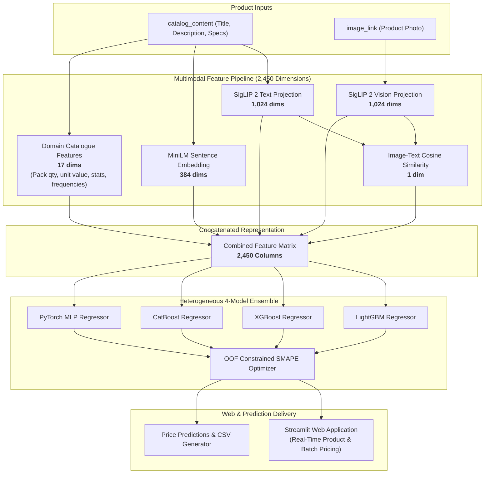

# 🏷️ Multimodal E-Commerce Product Price Predictor

[](https://github.com/krishnablji)
[](https://www.python.org/)
[](https://pytorch.org/)
[](https://huggingface.co/)
[](https://streamlit.io/)
[](LICENSE)

A production-grade **Multimodal Deep Learning & Ensemble System** that fuses visual embeddings from **Google SigLIP 2**, semantic text embeddings from **MiniLM**, and domain-engineered catalogue features into a 4-model ensemble (**LightGBM**, **XGBoost**, **CatBoost**, **PyTorch MLP**) for optimal e-commerce product price prediction.

Includes an interactive **Streamlit Web Application** for instant real-time pricing and batch CSV evaluation.

---

## 🌟 Architecture Overview



---

## 📊 Feature Matrix Specification

| Feature Block | Width | Semantic Role |
| :--- | :---: | :--- |
| **SigLIP 2 Vision Projection** | 1,024 | Product appearance, packaging, shape, color, and visual context |
| **SigLIP 2 Text Projection** | 1,024 | Product title, specifications, and catalogue descriptions |
| **Image–Text Cosine Similarity** | 1 | Cross-modal agreement score between photo and text |
| **MiniLM Text Embeddings** | 384 | Compact sentence-level semantic representations |
| **Engineered Catalogue Rules** | 17 | Pack quantity, base unit values, total declared value, text lengths, bullet/measurement counts, brand/category frequency encoding |
| **Combined Width** | **2,450** | **Holistic Multimodal Matrix** |

---

## 🚀 Quickstart

### 1. Installation
Clone the repository and install dependencies:
```bash
git clone https://github.com/krishnablji/Multimodal-Price-Predictor.git
cd Multimodal-Price-Predictor

# Install with pip
pip install -e .
```

---

## 💻 Running the Streamlit Web Application

Launch the interactive web dashboard with:
```bash
streamlit run app.py
```

### Web App Features:
* **🎯 Single Product Estimator:** Paste any product description or bullet points, upload an image or provide an image URL, and receive instant estimated prices, confidence intervals, image-text alignment score, and individual model breakdowns.
* **📁 Batch CSV Predictor:** Upload a product dataset CSV file (`sample_id`, `catalog_content`, `image_link`), monitor live inference progress, and download predictions.
* **🔬 Architecture & Insights:** Explore feature widths, ensemble blend weights, and SMAPE metric formulas.

---

## 📦 Dataset & Formats

The pipeline accepts standard e-commerce catalogue records with the following schema:
* `sample_id`: Unique record identifier.
* `catalog_content`: Product title, bullet points, specifications, and brand.
* `image_link`: Product image URL or file path.
* `price`: Actual product price (target variable for training).

### 1. Sample Datasets (Included)
Sample datasets matching the exact schema are provided in [`data/samples/`](data/samples/) (`demo_train.csv`, `demo_test.csv`) so you can test and run the application immediately.

### 2. Full 150k E-Commerce Dataset
To download the complete large-scale multimodal e-commerce product dataset (75,000 train products + 75,000 test products):
```bash
python scripts/download_kaggle_data.py --dest data/raw/
```

---

## 🛠️ CLI Pipeline Commands

You can run each stage of the training and prediction pipeline via CLI:

```bash
# 1. Validate dataset schemas and sample IDs
python -m src.price_predictor.cli validate-data --train-csv data/samples/demo_train.csv --test-csv data/samples/demo_test.csv

# 2. Run full 5-fold training and generate predictions
python -m src.price_predictor.cli run --train-csv data/samples/demo_train.csv --test-csv data/samples/demo_test.csv --artifact-dir artifacts/final
```

---

## 🧪 Testing

Run the automated test suite with `pytest`:
```bash
pytest tests/
```

---

## 📚 Technical References

* **SigLIP 2:** Tschannen et al., *SigLIP 2: Multilingual Vision-Language Encoders with Improved Semantic Alignment* ([HuggingFace](https://huggingface.co/google/siglip2-large-patch16-384))
* **Sentence-Transformers:** Reimers & Gurevych, *Sentence-BERT: Sentence Embeddings using Siamese BERT-Networks* (`all-MiniLM-L6-v2`)
* **Gradient Boosting:** [LightGBM](https://lightgbm.readthedocs.io/), [XGBoost](https://xgboost.readthedocs.io/), [CatBoost](https://catboost.ai/)
* **Deep Learning:** [PyTorch](https://pytorch.org/)

---

## 📜 License
Released under the [MIT License](LICENSE).
